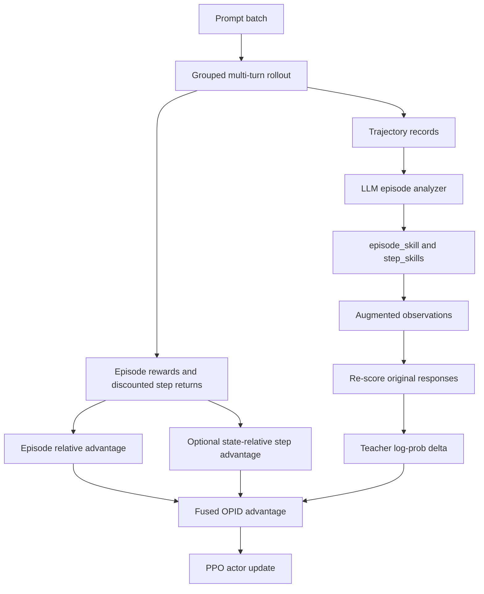

# OPID 算法技术说明

## 摘要

本文档说明当前仓库中 OPID 算法的实现形态、数学目标和训练流程。当前
OPID 是一种面向多步智能体任务的 critic-free on-policy 优化方法。它以
GRPO 风格的组内 episode-relative advantage 为基础，并引入由大模型轨迹
分析产生的 hindsight skill。需要强调的是，分析大模型不直接给 reward
或 value；它只把一条完整轨迹总结为 `episode_skill` 和若干 `step_skills`。
训练器随后将这些 skill 注入当前 observation，并用当前策略重新计算“原始
动作”在增强 prompt 下的 log-prob。增强 prompt 与原始 prompt 的
log-prob 差值构成 token-level teacher advantage。

在当前打开的 AlfWorld 启动脚本
[`examples/opid_trainer/run_alfworld_opid_guide.sh`](../../examples/opid_trainer/run_alfworld_opid_guide.sh)
中，实际运行的是 episode-level OPID：

- `algorithm.adv_estimator=opid`
- `algorithm.opid.mode=mean_norm`
- `algorithm.opid.step_advantage_w=0.0`
- `algorithm.opid.episode_skill_teacher_advantage_w=0.001`
- `algorithm.opid.step_skill_teacher_advantage_w=0.001`

因此，当前训练主要由 episode outcome relative advantage 驱动，LLM
hindsight teacher signal 作为小权重的 shaping 项进入 PPO advantage。

## 1. 问题定义

考虑一个多步文本环境。训练器从数据集中采样一批原始任务 prompt，并对每个
prompt 采样 \(K\) 条 on-policy 轨迹。在实现中，同一个原始任务的多个
rollout 共享 `uid`，每条具体轨迹有独立的 `traj_uid`。第 \(g\) 个任务组中
第 \(k\) 条轨迹记为：

$$
\tau_{g,k}
=
\{(o_{g,k,t}, y_{g,k,t}, r_{g,k,t})\}_{t=0}^{T_{g,k}-1}.
$$

其中 \(o_{g,k,t}\) 是第 \(t\) 步 observation，\(y_{g,k,t}\) 是策略生成的
文本动作或响应，\(r_{g,k,t}\) 是环境在该步返回的标量 reward。响应
\(y_{g,k,t}\) 是 token 序列：

$$
y_{g,k,t}
=
(y_{g,k,t,1}, \ldots, y_{g,k,t,L_{g,k,t}}).
$$

OPID 的目标是在稀疏、延迟且高方差的 agent reward 场景下，保留
GRPO-like critic-free 训练的稳定性，同时利用完整轨迹的 hindsight 信息
为关键决策提供更细粒度的 token-level 更新信号。

## 2. 整体算法草图



这张图对应当前代码的主路径：先做 grouped rollout，再重建轨迹并请求 LLM
生成 hindsight skill；之后用增强 observation 重新打分原始 response，
将 log-prob delta 与 episode advantage 融合，最后使用 PPO actor loss
更新策略。

## 3. 符号表

| 符号 | 含义 | 实现字段 |
| --- | --- | --- |
| \(g\) | 原始任务组或 prompt group | `uid` |
| \(k\) | 同组内第 \(k\) 条 rollout | 由重复采样隐式表示 |
| \(t\) | 环境步编号 | `step_idx`, `step_num` |
| \(\tau_{g,k}\) | 一条完整采样轨迹 | `traj_uid` |
| \(o_{g,k,t}\) | 第 \(t\) 步 observation | `obs_text`, `obs_text_base` |
| \(y_{g,k,t}\) | 第 \(t\) 步 response/action tokens | `responses` |
| \(R_{g,k}\) | episode outcome score | `episode_rewards` |
| \(G_{g,k,t}\) | discounted step return | `step_rewards` |
| \(m_{i,\ell}\) | 第 \(i\) 个样本第 \(\ell\) 个 response token 的有效 mask | `response_mask` |
| \(\ell^{old}\) | 原始 prompt 下的 token log-prob | `old_log_probs` |
| \(\ell^{ep}\) | episode skill 增强 prompt 下的 token log-prob | `episode_teacher_log_prob` |
| \(\ell^{step}\) | step skill 增强 prompt 下的 token log-prob | `step_teacher_log_prob` |

下文使用 \(i\) 表示 flatten 后的 rollout-step 样本索引。一个完整轨迹会被
展开为多个训练样本，每个样本对应环境中的一个决策步。

## 4. Rollout 与 reward 构造

多步 rollout 由
[`agent_system/multi_turn_rollout/rollout_loop.py`](../../agent_system/multi_turn_rollout/rollout_loop.py)
实现。对每个原始 prompt，环境被重复采样 `env.rollout.n` 次。当前 AlfWorld
脚本中该值为 8，因此每个任务组最多包含 8 条轨迹。rollout loop 在每一步：

1. 根据当前 observation 构造模型输入；
2. 由 actor 生成文本动作；
3. 将动作提交给环境；
4. 记录 reward、done、action validity、`uid`、`traj_uid` 和 step metadata；
5. 若所有环境均结束，则停止该批次 rollout。

rollout 结束后，`gather_rollout_data` 将所有 active step 展平成一个训练
batch。episode reward 由
[`agent_system/reward_manager/episode.py`](../../agent_system/reward_manager/episode.py)
写入每个 response 的最后一个有效 token，因此对 token-level reward 求和可
恢复该样本的 episode outcome score。

对于 OPID 和 GiGPO，训练器还会计算 discounted step return：

$$
G_{g,k,t}
=
\sum_{u=t}^{T_{g,k}-1}
\gamma^{u-t} r_{g,k,u}.
$$

当前 AlfWorld 脚本设置 `algorithm.gamma=0.95`。对应实现为
[`gigpo/core_gigpo.py`](../../gigpo/core_gigpo.py) 中的
`compute_step_discounted_returns`。

## 5. Episode-level relative advantage

令 \(S_i\) 为 flatten 后第 \(i\) 个样本的 outcome score。样本 \(i\) 属于
任务组 \(g(i)\)。OPID 首先计算组内相对 episode advantage。

在当前 `mean_norm` 模式下：

$$
A^{ep}_i
=
S_i - \mu_{g(i)},
$$

其中

$$
\mu_g
=
\frac{1}{|\mathcal{I}_g|}
\sum_{j \in \mathcal{I}_g} S_j.
$$

\(\mathcal{I}_g\) 表示属于同一 `uid` 的 flatten 样本集合。注意当前实现
默认跨 trajectory step 计算均值，即同一轨迹中的多个 step 也会参与该组
baseline 的估计。这与 `episode_norm_reward` 中
`compute_mean_std_cross_steps=True` 的默认行为一致。

若使用 `mean_std_norm`，则 advantage 会进一步除以组内标准差：

$$
A^{ep}_i
=
\frac{S_i - \mu_{g(i)}}{\sigma_{g(i)} + \epsilon}.
$$

最后，标量 advantage 被广播到每个有效 response token：

$$
A^{ep}_{i,\ell}
=
A^{ep}_i \cdot m_{i,\ell}.
$$

这一部分由
[`gigpo/core_gigpo.py`](../../gigpo/core_gigpo.py) 中的
`episode_norm_reward` 和 `compute_opid_advantage_components` 实现。

## 6. 可选的 state-relative step advantage

OPID 可以复用 GiGPO 的 state grouping 机制。当
`algorithm.opid.step_advantage_w` 非零时，训练器会在同一个 `uid` 内按照
`anchor_obs` 对 observation 进行分组。每个 state group 内使用 discounted
step return 计算 step-level relative advantage：

$$
A^{step}_i
=
G_i - \bar{G}_{c(i)},
$$

其中 \(c(i)\) 是样本 \(i\) 所属的 state group。若启用 `mean_std_norm`：

$$
A^{step}_i
=
\frac{G_i - \bar{G}_{c(i)}}{\sigma_{c(i)}+\epsilon}.
$$

不过在当前 AlfWorld OPID 脚本中：

$$
w_{step}=0.
$$

因此该项不会进入最终 advantage。episode-level OPID 的配置校验也要求
`step_advantage_w=0.0`。

## 7. Hindsight Skill 生成

OPID 会把每条 `traj_uid` 对应的 step 重新组装为有序轨迹记录，每个 step
包含：

```text
step_index
observation
observation_prompt
response
step_reward
task_description
```

轨迹分析由
[`opid/analysis.py`](../../opid/analysis.py) 中的 `OPIDEpisodeAnalyzer`
完成。它调用 OpenAI-compatible backend，并要求 LLM 返回合法 JSON：

```json
{
  "episode_summary": "string",
  "episode_skill": "string",
  "step_skills": {
    "0": "skill for step 0",
    "2": "skill for step 2"
  }
}
```

当前 prompt 设计区分成功和失败轨迹：

- 若 episode 成功，`episode_skill` 应抽象为可复用 workflow；
- 若 episode 失败，`episode_skill` 应抽象为 avoidance rule；
- `step_skills` 是面向策略的短 imperative skills，用于少量关键步。

当前 AlfWorld 脚本设置
`algorithm.opid.analysis_max_step_skills_per_traj=5`，所以每条轨迹最多保留
5 个 step-level skills。若 LLM 输出 JSON 解析失败，分析器会重试；若最终仍
失败或缺少必需字段，该轨迹不会产生 teacher signal。

## 8. Observation 增强与 teacher scoring

对每条成功分析的轨迹，普通 OPID 会将该轨迹中的所有 step 视为可进行
hindsight teacher scoring 的样本。具体使用哪一种 skill 由如下规则决定：

1. 如果当前 step 有非空 `step_skill`，且
   `step_skill_teacher_advantage_w > 0`，则使用 step-level skill；
2. 否则，如果 episode-level teacher 权重大于 0，则使用 `episode_skill`；
3. 若两类权重均为 0，则该 step 不产生 teacher log-prob。

skill 注入逻辑位于
[`opid/prompting.py`](../../opid/prompting.py)。
增强 observation 的文本形态为：

```text
Episode-Level Skill
Refer to this episode-level skill when deciding what action to take in the current episode:
[...]

Critical-Step Skill
Use this current-step skill for this decision only:
[...]
```

令 \(h^{ep}(o_i)\) 表示插入 episode skill 后的 observation，
\(h^{step}(o_i)\) 表示插入 step skill 后的 observation。训练器不会重新采样
动作，而是计算原始 response 在增强 prompt 下的 log-prob：

$$
\ell^{ep}_{i,\ell}
=
\log \pi_{\theta_{old}}
\left(
y_{i,\ell}
\mid
h^{ep}(o_i), y_{i,<\ell}
\right),
$$

$$
\ell^{step}_{i,\ell}
=
\log \pi_{\theta_{old}}
\left(
y_{i,\ell}
\mid
h^{step}(o_i), y_{i,<\ell}
\right).
$$

原始 prompt 下的 log-prob 为：

$$
\ell^{old}_{i,\ell}
=
\log \pi_{\theta_{old}}
\left(
y_{i,\ell}
\mid
o_i, y_{i,<\ell}
\right).
$$

因此，这里的 teacher 不是独立专家模型，而是“同一个当前策略在更强上下文
prompt 下的条件概率”。这使 OPID 更接近一种 prompt-conditioned
self-distillation。

## 9. Teacher advantage

teacher advantage 定义为增强 prompt log-prob 与原始 prompt log-prob 的差：

$$
\Delta^{ep}_{i,\ell}
=
\left(
\ell^{ep}_{i,\ell}
-
\ell^{old}_{i,\ell}
\right)
\cdot m_{i,\ell}
\cdot q^{ep}_i,
$$

$$
\Delta^{step}_{i,\ell}
=
\left(
\ell^{step}_{i,\ell}
-
\ell^{old}_{i,\ell}
\right)
\cdot m_{i,\ell}
\cdot q^{step}_i.
$$

其中 \(q^{ep}_i\) 和 \(q^{step}_i\) 是样本级 mask，分别表示该样本是否使用
episode skill 或 step skill 进行 teacher scoring。若 \(\Delta>0\)，表示
hindsight skill 使原始动作更可能，PPO 更新会更倾向于强化该动作；若
\(\Delta<0\)，则表示 skill 认为该动作在增强上下文下更不合理，对应产生
抑制作用。

实现函数为
[`gigpo/core_gigpo.py`](../../gigpo/core_gigpo.py) 中的
`compute_teacher_token_advantage`。该函数还支持可选归一化和截断：

- `algorithm.opid.normalize_teacher_adv`
- `algorithm.opid.clip_teacher_adv`

当前 AlfWorld 脚本设置 `normalize_teacher_adv=False`，且未启用
`clip_teacher_adv`。

## 10. 最终 OPID advantage

OPID 的最终 token-level advantage 为：

$$
A^{OPID}_{i,\ell}
=
A^{ep}_{i,\ell}
+
w_{step} A^{step}_{i,\ell}
+
w_{ep} \Delta^{ep}_{i,\ell}
+
w_{stepSkill} \Delta^{step}_{i,\ell}.
$$

当前 AlfWorld 脚本对应：

$$
w_{step}=0,\quad
w_{ep}=10^{-3},\quad
w_{stepSkill}=10^{-3}.
$$

因此实际生效的形式为：

$$
A^{OPID}_{i,\ell}
=
A^{ep}_{i,\ell}
+
10^{-3}\Delta^{ep}_{i,\ell}
+
10^{-3}\Delta^{step}_{i,\ell}.
$$

该融合逻辑位于
[`gigpo/core_gigpo.py`](../../gigpo/core_gigpo.py) 中的
`compute_opid_outcome_advantage` 和 `compute_opid_advantage_components`。

## 11. PPO 目标

得到 \(A^{OPID}\) 后，训练器使用标准 PPO actor update。令：

$$
\rho_{i,\ell}(\theta)
=
\exp
\left(
\log \pi_{\theta}(y_{i,\ell}\mid o_i,y_{i,<\ell})
-
\log \pi_{\theta_{old}}(y_{i,\ell}\mid o_i,y_{i,<\ell})
\right).
$$

PPO clipped objective 可写为：

$$
\mathcal{L}_{policy}(\theta)
=
-
\mathbb{E}_{i,\ell}
\left[
\min
\left(
\rho_{i,\ell}(\theta) A^{OPID}_{i,\ell},
\operatorname{clip}
(\rho_{i,\ell}(\theta),1-\epsilon,1+\epsilon)
A^{OPID}_{i,\ell}
\right)
\right].
$$

当前 AlfWorld 脚本还启用了 actor KL loss：

- `actor_rollout_ref.actor.use_kl_loss=True`
- `actor_rollout_ref.actor.kl_loss_coef=0.01`
- `actor_rollout_ref.actor.kl_loss_type=low_var_kl`

此外，旧的 signed auxiliary OPD loss 路径已移除。若需要额外的
distillation loss，当前实现使用 SDAR-style gated auxiliary loss：
[`verl/trainer/ppo/core_algos.py`](../../verl/trainer/ppo/core_algos.py) 的
`compute_sdar_loss`，以及
[`verl/workers/actor/dp_actor.py`](../../verl/workers/actor/dp_actor.py) 的
actor update。

## 12. 算法伪代码

```text
Algorithm: One OPID training step

Input:
  policy pi_theta
  grouped prompt batch B
  rollout group size K
  environment E
  discount gamma
  weights w_step, w_ep, w_stepSkill

1. Run grouped multi-turn rollout.
   For each prompt group g and rollout k:
     collect tau_{g,k}
     store uid, traj_uid, observations, responses, rewards

2. Construct rewards.
   Put episode score on the last valid response token.
   Compute discounted step return G_{g,k,t}.

3. Run OPID analysis if enabled.
   Reconstruct each traj_uid into ordered step records.
   Send the trajectory to OPIDEpisodeAnalyzer.
   Parse episode_summary, episode_skill, step_skills.
   Drop trajectories with invalid JSON or missing required skills.

4. Build augmented observations.
   For each analyzed step:
     if step_skill exists and w_stepSkill > 0:
       insert Critical-Step Skill
       mark q_step = 1
     else if episode_skill is enabled:
       insert Episode-Level Skill
       mark q_ep = 1

5. Re-score original responses.
   Compute old_log_probs under original observations.
   Compute teacher log-probs under augmented observations.
   Delta = teacher_log_prob - old_log_prob.

6. Compute fused OPID advantage.
   A_ep = group-relative episode advantage.
   A_step = optional state-relative step advantage.
   A_OPID = A_ep
            + w_step * A_step
            + w_ep * Delta_ep
            + w_stepSkill * Delta_step.

7. Update actor with PPO.
   Use A_OPID in the clipped PPO objective.
   Add KL loss if configured.
   Add SDAR-style auxiliary distillation loss only if sdar_loss_coef > 0.
```

## 13. 当前 AlfWorld 配置解读

| 配置项 | 当前值 | 作用 |
| --- | --- | --- |
| `env.env_name` | `alfworld/AlfredTWEnv` | 使用文本版 AlfWorld 环境 |
| `env.rollout.n` | `8` | 每个 prompt group 采样 8 条轨迹 |
| `algorithm.gamma` | `0.95` | discounted step return 的折扣因子 |
| `algorithm.adv_estimator` | `opid` | 使用 OPID advantage estimator |
| `algorithm.opid.mode` | `mean_norm` | 组内只减均值，不除标准差 |
| `algorithm.opid.step_advantage_w` | `0.0` | 关闭 GiGPO step advantage |
| `algorithm.opid.episode_skill_teacher_advantage_w` | `0.001` | episode-skill teacher signal 独立权重 |
| `algorithm.opid.step_skill_teacher_advantage_w` | `0.001` | step-skill teacher signal 独立权重 |
| `algorithm.opid.enable_analysis` | `True` | 开启 LLM 轨迹分析 |
| `algorithm.opid.selector` | `llm` | 使用 LLM JSON analyzer |
| `algorithm.opid.analysis_backend` | `openai` | 使用 OpenAI-compatible 后端 |
| `algorithm.opid.analysis_num_workers` | `128` | 并发分析轨迹 |
| `algorithm.opid.analysis_max_step_skills_per_traj` | `5` | 每条轨迹最多保留 5 个 step skills |
| `algorithm.opid.failed_only` | `False` | 成功和失败轨迹都分析 |
| `algorithm.opid.opd_start_after_steps` | `null` | 从训练开始即允许 teacher signal |
| `algorithm.opid.opd_stop_after_steps` | `null` | 不设置 teacher signal 停止步数 |
| `actor_rollout_ref.actor.sdar_loss_coef` | `0.0` | 默认不使用 SDAR-style auxiliary distillation loss |

## 14. 实现映射

| 功能 | 主要实现位置 |
| --- | --- |
| 多步 rollout 与 `uid`/`traj_uid` 分配 | [`agent_system/multi_turn_rollout/rollout_loop.py`](../../agent_system/multi_turn_rollout/rollout_loop.py) |
| episode reward tensor 构造 | [`agent_system/reward_manager/episode.py`](../../agent_system/reward_manager/episode.py) |
| OPID 训练器集成 | [`verl/trainer/ppo/ray_trainer.py`](../../verl/trainer/ppo/ray_trainer.py) |
| LLM 轨迹分析器 | [`opid/analysis.py`](../../opid/analysis.py) |
| skill 注入 observation | [`opid/prompting.py`](../../opid/prompting.py) |
| episode/teacher advantage 计算 | [`gigpo/core_gigpo.py`](../../gigpo/core_gigpo.py) |
| PPO actor update | [`verl/workers/actor/dp_actor.py`](../../verl/workers/actor/dp_actor.py) |
| OPID 默认配置 | [`verl/trainer/config/ppo_trainer.yaml`](../../verl/trainer/config/ppo_trainer.yaml) |
| AlfWorld OPID 启动脚本 | [`examples/opid_trainer/run_alfworld_opid_guide.sh`](../../examples/opid_trainer/run_alfworld_opid_guide.sh) |

## 15. 讨论与局限

1. OPID 的 teacher signal 是 prompt-conditioned self-distillation，不是
   外部 reward model。它度量的是 hindsight skill 对当前策略原始动作
   log-prob 的影响。

2. 当前 OPID 路径要求 `selector=llm`，且要求
   `algorithm.opid.step_advantage_w=0.0`。

3. 当前 teacher scoring 只支持 text prompt。若 batch 中存在
   `multi_modal_inputs`，OPID teacher signal 会被跳过。

4. LLM analysis 的质量会直接影响 teacher delta。解析器能处理 JSON 失败并
   重试，但无法保证 skill 在语义上总是高质量。

5. 当前 AlfWorld 配置中 episode-skill 和 step-skill teacher 权重均为
   \(10^{-3}\)，因此主导项仍然是 episode outcome advantage。训练时应关注
   日志中的 `opid/adv/*` 指标，尤其是 episode、step、teacher 三类分量的
   绝对均值和 share。

6. LLM 分析按 trajectory 发起请求，成本由 rollout batch 中的轨迹数量、
   `analysis_num_workers` 和 `analysis_max_completion_tokens` 共同决定。

## 16. 结论

当前 OPID 可以概括为：

$$
\text{OPID}
=
\text{GRPO-style episode relative advantage}
+
\text{LLM-hindsight prompt advantage}.
$$

它不改变 PPO actor update 的基本形式，而是替换 advantage 的构造方式。
LLM 负责把完整轨迹转化为可执行的 hindsight skill；当前策略负责将该
skill 转换为 token-level log-prob delta。最终，episode outcome signal
与 teacher prompt signal 共同形成用于 PPO 更新的 \(A^{OPID}\)。
